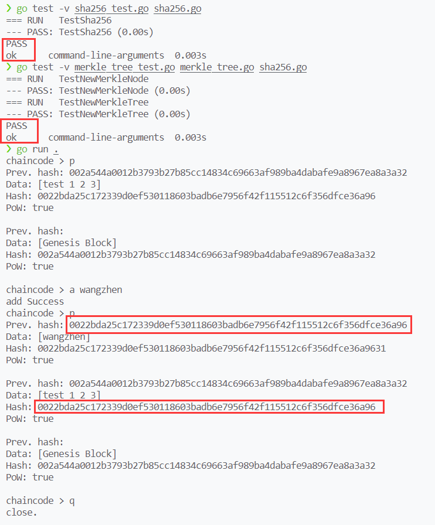

**汪震 PB19000078**
April 08 Fri, 2022

# 实验一

## Sha256 的实现

个人感觉难点在于字节的处理，比如消息补全、分块、与 uint32 之间的转换。主要对于 go 语言不熟悉，特别是 go 对类型的限制非常强，切片和数组之间反复类型转换。
（代码较长，另附文件）

## Merkle 树的构造

构造节点并不难，但要注意奇数情况的特殊处理，将 left 节点的内容复制一次，构造与 left 相同的 right 节点。

```go
func NewMerkleNode(left, right *MerkleNode, data []byte) *MerkleNode {
	node := MerkleNode{}
	node.Left = left
	node.Right = right
	temp := [32]byte{}
	if left == nil {
		temp = mySha256(data)
	} else {
		if right == nil { //奇数情况
			right = &MerkleNode{nil, nil, left.Data}
		}
		temp = mySha256(bytes.Join([][]byte{left.Data, right.Data}, []byte{}))
	}
	node.Data = make([]byte, 32)
	copy(node.Data, temp[:])
	return &node
}
```

生成树时，增加了函数`dfs`，向下深度优先，先构造出底层的节点，向上返回后，再构造底层节点的父节点。特别注意参数除了有`data`，还有`depth`控制是否达到叶子节点，`num`控制叶结点由哪个`data`生成，`numLimit`控制是否使用完全部`data`，向上返回的除了`MerkleNode`节点，还有`num`表明有多少`data`已被使用，对上层的`num`进行更新。

```go
// NewMerkleTree creates a new Merkle tree from a sequence of data
// implement
func NewMerkleTree(data [][]byte) *MerkleTree {
	num := len(data)
	depth := math.Ceil(math.Log2(float64(num)))
	node, _ := dfs(data, int(depth), 0, num)
	var mTree = MerkleTree{node}

	return &mTree
}

func dfs(data [][]byte, depth, num, numLimit int) (*MerkleNode, int) {
	if depth == 0 {
		if num < numLimit {
			return NewMerkleNode(nil, nil, data[num]), num + 1
		}
		return nil, num
	}
	left, numLeft := dfs(data, depth-1, num, numLimit)
	right, numRight := dfs(data, depth-1, numLeft, numLimit)
	node, numTol := NewMerkleNode(left, right, nil), numRight
	return node, numTol
}
```

## AddBlock 实现

比较简单，调用`NewBlock`生成新块，再模仿`NewBlockchain`，将新块插入数据库，并更新`l`即可。

```go
// AddBlock saves provided data as a block in the blockchain
// implement
func (bc *Blockchain) AddBlock(data []string) {
	nBlock := NewBlock(data, bc.tip)
	err := bc.db.Update(func(tx *bolt.Tx) error {
		b := tx.Bucket([]byte(blocksBucket))

		errIn := b.Put(nBlock.Hash, nBlock.Serialize())
		if errIn != nil {
			log.Panic(errIn)
		}

		errIn = b.Put([]byte("l"), nBlock.Hash)
		if errIn != nil {
			log.Panic(errIn)
		}
		bc.tip = nBlock.Hash

		return nil
	})
	if err != nil {
		log.Panic(err)
	}
}
```

## 运行结果

运行结果如图

